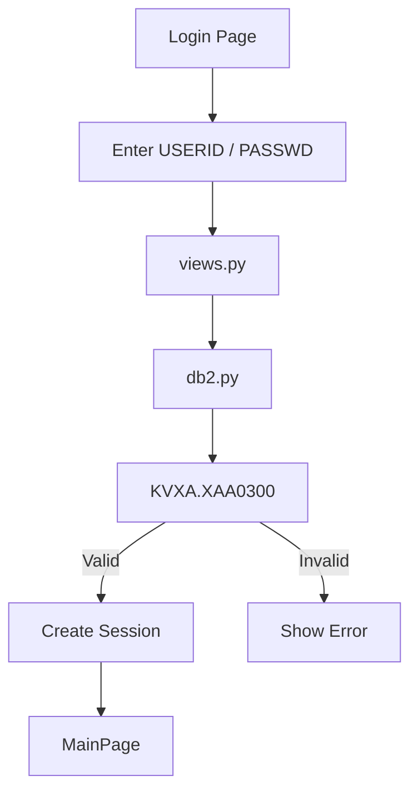

# 🔐 Web Python Django - Login To MainPage

<div align="center">


### 🚀 Simple Authentication System using Django & IBM DB2

Authenticate users from IBM DB2 (AS400) and redirect them to a secured MainPage using Django Sessions.

</div>

---

## 📸 Preview

### 🔑 Login Page

```text
+--------------------------------+
|           LOGIN               |
+--------------------------------+
| USERID                         |
| PASSWORD                       |
|                                |
|      [ LOGIN ]                 |
+--------------------------------+
```

### 🏠 MainPage

```text
+--------------------------------+
| Welcome User                   |
|                                |
| Logged in as: USERID           |
|                                |
|      [ LOGOUT ]                |
+--------------------------------+
```

---

# ✨ Features

* 🔐 User Authentication
* 🗄️ IBM DB2 Integration
* 🔌 ODBC Database Connection
* 👤 Session Management
* 🚪 Logout Function
* 🎨 Customizable UI
* ⚡ Fast & Lightweight
* 🐍 Django Framework

---

# 🏗️ Architecture

```text
┌─────────────┐
│ Login Page  │
└──────┬──────┘
       │
       ▼
┌─────────────┐
│  views.py   │
└──────┬──────┘
       │
       ▼
┌─────────────┐
│   db2.py    │
└──────┬──────┘
       │
       ▼
┌─────────────┐
│ KVXA.XAA0300│
└──────┬──────┘
       │
       ▼
┌─────────────┐
│  MainPage   │
└─────────────┘
```

---

# 📂 Project Structure

```text
Web-Python-Django_Demo_LoginToMainPage
│
├── manage.py
│
├── config/
│   ├── settings.py
│   ├── urls.py
│   ├── asgi.py
│   └── wsgi.py
│
├── accounts/
│   ├── db2.py
│   ├── views.py
│   ├── urls.py
│   ├── models.py
│   ├── admin.py
│   ├── apps.py
│   │
│   └── templates/
│       └── accounts/
│           ├── login.html
│           └── mainpage.html
│
├── requirements.txt
└── README.md
```

---

# 🛠️ Technology Stack

| Technology | Description       |
| ---------- | ----------------- |
| Python     | Backend Language  |
| Django     | Web Framework     |
| IBM DB2    | Database          |
| ODBC       | Database Driver   |
| HTML5      | Frontend          |
| CSS3       | Styling           |
| JavaScript | Client-side Logic |

---

# ⚙️ Database Configuration

Edit:

```python
config/settings.py
```

```python
DB2_ODBC = {
    "DSN": "QDSN_10.20.196.7",
    "UID": "SISKJK",
    "PWD": "SISKJK",
}
```

---

# 🗄️ Database Table

```sql
KVXA.XAA0300
```

Required fields:

```sql
USERID
PASSWD
```

Example:

```sql
SELECT USERID,
       PASSWD
FROM KVXA.XAA0300
```

---

# 🚀 Installation

## Clone Repository

```bash
git clone https://github.com/ngtrkhnguyen/Web-Python-Django_Demo_LoginToMainPage.git
```

```bash
cd Web-Python-Django_Demo_LoginToMainPage
```

---

## Create Virtual Environment

```bash
python -m venv venv
```

### Windows

```bash
venv\Scripts\activate
```

### Linux / MacOS

```bash
source venv/bin/activate
```

---

## Install Dependencies

```bash
pip install -r requirements.txt
```

---

## Apply Migration

```bash
python manage.py migrate
```

---

## Run Server

```bash
python manage.py runserver
```

Open:

```text
http://127.0.0.1:8000
```

---

# 🔄 Authentication Flow



---

# 🔒 Security

* Session-based Authentication
* CSRF Protection
* Database Parameter Binding
* SQL Injection Prevention
* Secure Django Middleware

---

# 📋 Future Improvements

* [ ] Password Hashing
* [ ] User Roles
* [ ] Dashboard UI
* [ ] Bootstrap 5 Integration
* [ ] User Profile Page
* [ ] Password Reset
* [ ] Activity Logging
* [ ] REST API

---

# 👨‍💻 Author

### Nguyen Truong Khoi Nguyen

**IT Developer**

* Python Django
* IBM DB2
* NodeJS
* SQL Server
* Oracle Database

---

<div align="center">

### ⭐ If you like this project, give it a star!

© 2026 Nguyen Truong Khoi Nguyen. All Rights Reserved.

</div>
